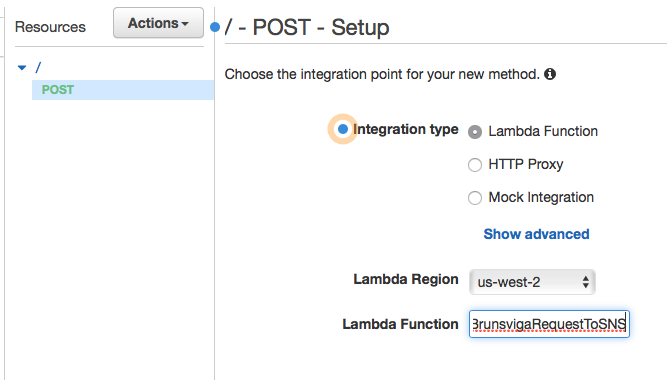

# brunsviga
Code for an api for a mechanical computer (Brunsviga 13RK). Wrapper around a human (or possibly robot) in the loop.

## beta
To access the current beta as described in ##Implementation] please email mattjb ät me dot com for the web urls: human friendly form and the underlying web API url. Note that I generally keep the Brunsviga 13RK at work, and I have a life outside of work, so don't expect a response to a web request after (Australian Eastern Standard/Daylight Time) work hours.

## Plan
Here's the overall plan
- [x] Provide human-friendly web form for submitting requests.
- [ ] Sanity check human input.
- [x] Use AWS gateway service to provide a REST API.
- [x] Trigger an AWS lambda function that sends JSON via AWS SNS of operation to be run by a human.
- [x] create s3 bucket for human operator to upload videos of calculations to (using iPhone with [Transmit-iOS](https://panic.com/transmit-ios/) app), then video link is to be emailed to requestor.

## Implementation
Note: I have removed my specific ID numbers and urls from files referenced, you would need to complete those before using.

1. Define an SNS topic, and subscribe the human operator's email address to that email.
2. Define a lambda function as per [lambda/index.js](lambda/index.js), and give it the lambda_basic_execution role. Then in AWS IAM edit that role and attach a policy as per [lambda/publish_brunsviga_sns_policy.json](lambda/publish_brunsviga_sns_policy.json) to allow the lambda function to publish to the SNS topic. The lambda function takes json from an http POST request of the (stringified) form `{"request": "function_to_evaluate", "email": "email_address_to_send_result_to"}`
3. Set up a POST API in API Gateway to call the lambda function either through the console

or by importing [swagger+api json](api/swagger+api.json). Make sure you enable CORS as appropriate for the hostname where your human-friendly web form will live, and make sure you deploy the API to prod.
4. Set up an s3 bucket (bucket policy to be world readable for holding [human-friendly web form](index.html) as well as results. Note you can't use s3 static web site hosting as it doesn't support https, either you need to look directly at the object url for index.html or use cloudfront or put it on some other https-enabled service.

## Future ideas
* How to deal with tracking and returning requests (use DynamoDB?).
* Could build a robot to work inputs and turn knob, plus OCR for readout.

## Images

