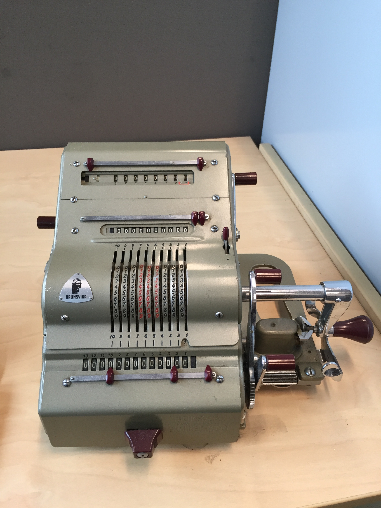

# brunsviga
Code for an API for a mechanical computer (Brunsviga 13RK). Wrapper around a human (or possibly robot) in the loop.

## LICENSE
Licensed under [GPLv3 licence](LICENCE) except for bootstrap and jquery components licensed under the [MIT licence](LICENCE.bootstrap).

## Access
To access the brunsviga as described in the Implementation section below, please check out [brunsviga.computer](https://brunsviga.computer). Note that I generally keep the Brunsviga 13RK at work, and I have a life outside of work, so don't expect a response to a web request after (Australian Central Standard/Daylight Time) work hours.

## Plan
Here's the overall plan
- [x] Provide human-friendly web form for submitting requests.
- [x] Sanity check human input.
- [x] Use AWS API gateway service to provide a REST API.
- [x] Trigger an AWS lambda function that sends JSON via AWS SNS of operation to be run by a human.
- [x] create s3 bucket for human operator to upload videos of calculations to (using iPhone with [Transmit-iOS](https://panic.com/transmit-ios/) app),
- [X] convert videos to mp4 and then upload, using AWS CloudFront to serve content for faster access. To do: look at AWS Elastic Transcoder for conversion (instead of Photos app on OS X).

then video link is emailed to requestor.

## Deployment
1. Define an SNS topic called *brunsviga*, and subscribe the human operator's email address to that email.
2. (Optional) update the `region` in [api/serverless.yml](api/serverless.yml).
3. Make sure you have [serverless](https://serverless.com/) installed: `npm install -g serverless` and have your [AWS credentials set up](https://serverless.com/framework/docs/providers/aws/guide/credentials/).
4. Set up an s3 bucket holding index.html and css/, fonts/, images/ and js/, and I also recommend using CloudFront CDN. The s3 upload can be done by `aws s3 cp web s3://mybucket/ --recursive`

## First calculation run

Video:

## Future ideas
* How to deal with tracking and returning requests (use DynamoDB?).
* Could build a robot to work inputs and turn knob, plus OCR for readout.

## Images

